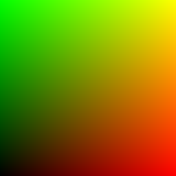
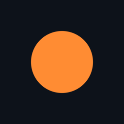
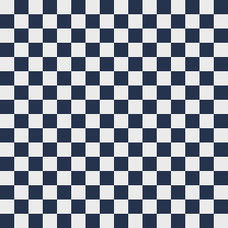
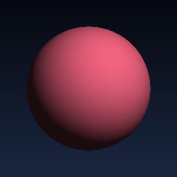

# easy_intro — 가벼운 Slang 컴퓨터그래픽스 입문 예제

`shader-slang/neural-shading-s25` 의 부속 폴더입니다. 본 저장소(neural-shading-s25)
의 본편 예제들 — 신경망 학습, mipmap 트레이닝, hardware-acceleration MLP — 은
**고성능 GPU** 를 가정하고 만들어져 있어서, 통합 그래픽스(예: Intel Iris Plus 640)
같은 환경에서는 컴파일 시간이 길거나 메모리가 부족할 수 있습니다.

이 폴더는 그런 환경에서도 **클릭 한 번에 실행해 볼 수 있는, 계산·메모리 부담이
거의 없는 4 개의 픽셀 셰이더 예제** 를 모아 두었습니다. 텍스처 한 장도, 신경망 한
줄도 사용하지 않습니다. 그 대신 컴퓨터 그래픽스의 핵심 개념들을 한 화면씩
시각적으로 보여줍니다.

> 개발 환경 기준: 2017 MacBook Pro 13" / Intel Iris Plus Graphics 640 (1.5 GB
> VRAM, Metal 3) / dual-core i7 / 16 GB RAM. 위에서 모두 잘 돕니다.

---

## 🖼 예제 한눈에 보기

| Step | 미리보기 | 무엇을 보여주나 |
|---|---|---|
| **01 — UV 좌표** |  | 픽셀 위치를 0~1 로 정규화해서 그대로 (R, G) 색으로. 모든 셰이더의 출발점. |
| **02 — SDF 원** |  | `length(p) - r` 한 줄로 매끄러운 원. 거리 함수(SDF)의 본질. |
| **03 — 체커보드** |  | 절차적(procedural) 패턴 — 텍스처 없이 함수만으로. |
| **04 — 구 + Lambert** |  | 노멀 한 번, 내적 한 번. 가장 단순한 조명 모델. |

각 셰이더는 픽셀당 수십 번의 부동소수점 연산이면 충분하기 때문에 통합 GPU 에서도
60 FPS 이상으로 부드럽게 돕니다.

---

## 🛠 준비물

```bash
pip install slangpy
```

`slangpy` 만 있으면 됩니다. (PIL, numpy, 텍스처, 신경망 모델 등 일체 불필요)

---

## ▶️ 실행

```bash
cd easy_intro
python step_01_uv.py
python step_02_circle.py
python step_03_checker.py
python step_04_sphere_lighting.py
```

각 창은 `Esc` 키로 닫을 수 있습니다.

---

## 📚 단계별 자세한 설명

### Step 01 — UV 좌표 시각화


```hlsl
float2 uv = (float2(pixel) + 0.5f) / float2(resolution);
uv.y = 1.0f - uv.y;
return float3(uv.x, uv.y, 0.0f);
```

- **개념**: 화면의 픽셀 좌표 `(x, y)` 를 0~1 범위로 정규화한 것이 **UV** 입니다.
- **시각적으로 보이는 것**: 가로축이 빨강, 세로축이 초록으로 점점 진해지는 그라데이션.
- **왜 중요한가**: 이후 모든 셰이더는 결국 "UV 를 어떤 색으로 바꿀 것인가" 라는
  하나의 질문에 답하는 함수입니다. UV 가 그래픽스의 좌표계라고 보면 됩니다.

---

### Step 02 — SDF 로 원 그리기


```hlsl
float d = length(p) - radius;          // 원까지의 거리
float aa = 1.5f / resolution.x;
float inside = smoothstep(aa, -aa, d); // 0~1 사이의 부드러운 경계
return lerp(bg, circle, inside);
```

- **개념**: **SDF (Signed Distance Field)** 는 어떤 점에서 도형 표면까지의 부호 있는
  거리입니다. 음수면 안쪽, 양수면 바깥, 0 이면 정확히 표면.
- **시각적으로 보이는 것**: 어두운 배경 위에 매끄럽게 안티에일리어싱이 적용된 주황 원.
- **왜 중요한가**: SDF 는 해상도와 무관하게 매끈한 도형을 그릴 수 있고, 모핑·블렌딩·
  레이마칭(raymarching) 등 현대 셰이더 트릭의 기반입니다. 그 본질이 위 한 줄입니다.

---

### Step 03 — 체커보드 (절차적 텍스처)


```hlsl
float2 cell = floor(p * 8.0f);
// fmod 는 피제수 부호를 따르므로 abs 로 항상 [0, 1] 범위 보장
float checker = abs(fmod(cell.x + cell.y, 2.0f));
return lerp(a, b, checker);
```

- **개념**: 좌표를 격자로 자른 뒤(`floor`), 칸의 합이 짝/홀이냐로 색을 결정합니다.
- **시각적으로 보이는 것**: 회색-남색의 8×8 체커보드.
- **왜 중요한가**: GPU 가 매 픽셀마다 함수를 평가해서 만드는 **절차적 텍스처** 는
  메모리를 거의 쓰지 않으면서 무한 해상도를 줍니다. 노이즈, 나무 결, 대리석 무늬 등
  대부분의 절차적 머티리얼은 이 아이디어의 확장입니다.

---

### Step 04 — 구체에 Lambert 조명


```hlsl
float z = sqrt(radius * radius - dot(p, p));
float3 normal = normalize(float3(p.x, p.y, z));
float ndotl = max(0.0f, dot(normal, light_dir));
return ambient + base_color * ndotl;
```

- **개념**: 화면 평면에 가상의 구를 놓고, 픽셀이 구 안쪽이면 그 위치의 **노멀(법선)**
  을 계산해서 **빛 방향과의 내적** (Lambert's cosine law) 으로 밝기를 결정합니다.
- **시각적으로 보이는 것**: 푸른 그라데이션 배경 위에 한쪽이 밝고 반대쪽은 어두운,
  부드럽게 음영진 분홍색 구.
- **왜 중요한가**: `N · L` 은 모든 사실적인 조명 모델 — Phong, Cook–Torrance, GGX,
  심지어 path tracing — 의 출발점입니다. 레이트레이서 한 줄도 없이 GPU 가 픽셀마다
  이 식을 푸는 것만으로 "3D 구" 가 보입니다.

---

## 🧭 다음 단계로 가는 길

이 4 개 예제를 충분히 이해했다면, 동일 저장소의 다음 폴더로 자연스럽게 넘어갈 수
있습니다:

| 폴더 | 다음 주제 |
|---|---|
| `mipmap/step_01_basicprogram.py` | 실제 텍스처 + BRDF 로 머티리얼 렌더링 |
| `network/step_01_basicnetwork.py` | 픽셀 셰이더 안에서 신경망 inference |
| `autodiff/square.slang` | Slang 의 자동 미분 (`bwd_diff`) 맛보기 |

---

## 📝 라이선스

상위 저장소와 동일하게 Apache License 2.0 을 따릅니다.
